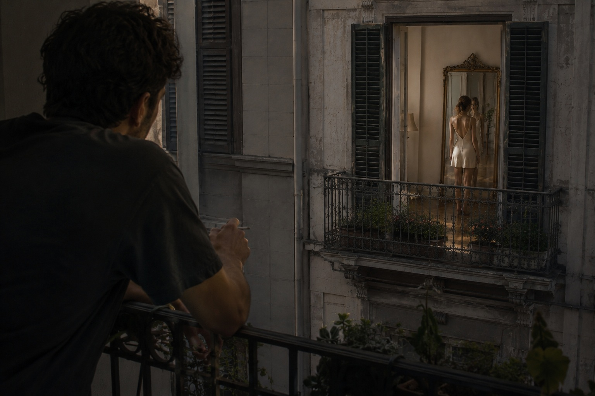

← [Back to Joe](./README.md) | ← [Entry One](./Arc1_Entry1.md)

---

# Arc One: The Neighbor
### Entry Two

I'm back, and guess what?

She's still there.

The lamp's off. It's 14 past 2. Who lights up a lamp when the sun's throwing these magnificent, cascading, flickering beams of light through the window, all over the floor?

Seems polished. Almost Venfitian. Or whatever they call it. The wood from Fenícia, right? I don't actually know what Venafitian floors look like. I just liked the word.

Wanna know what she's wearing?

I'm glad you asked. It's a white satin dress. Wait, no—wool. It's wool pretending to be satin. The satin's probably somewhere else. Knowing her, I'd say it's the panties. And from what I can see, they're blue.

A very specific blue.

The kind of blue that tells you everything you need to know.

She is sad.

You can tell from the blue.

Which—actually, reminds me, the guy two doors down, the one with the motorcycle he never rides, he told me once you can tell everything about a person from their sock drawer. Not even joking. His ex-wife's socks were always folded in pairs and that's how he knew she was leaving before she told him. Folded socks. I don't know. I don't really look at socks. I look at other things.

I don't even fold them. That's why I sometimes use only one because I can't find the pair. I ain't shedding my secrets like that.

Fuck.

Gotta go.

---

← [Back to Joe](./README.md) | ← [Entry One](./Arc1_Entry1.md)
